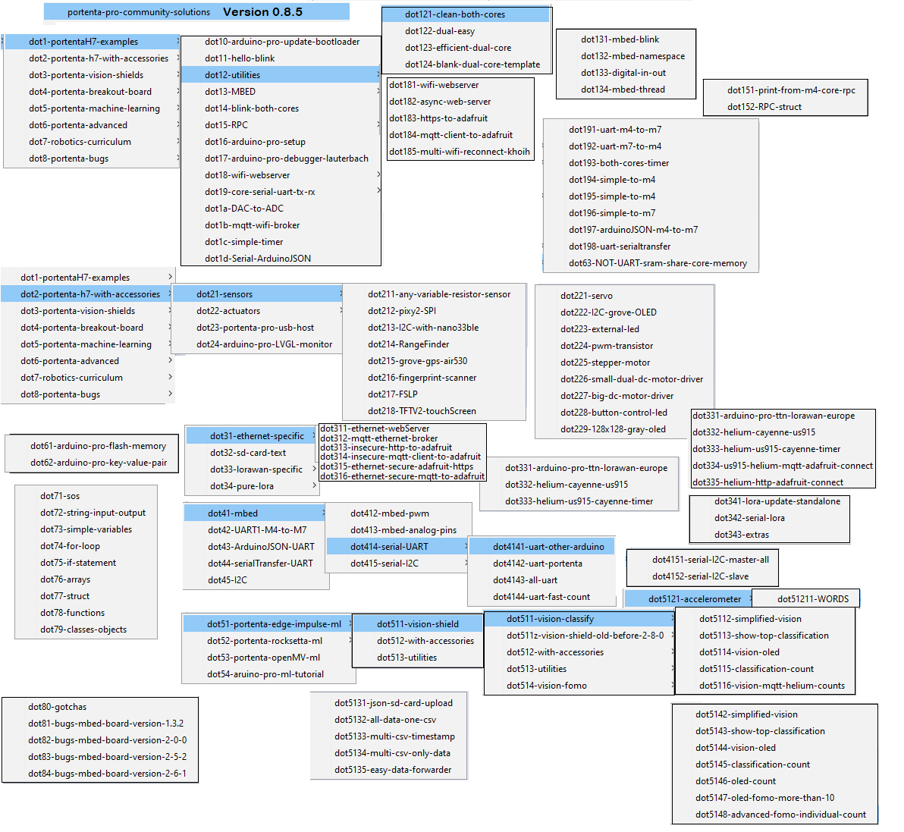

### Jeremy Ellis tinyML Sept 2022 5 min Lightning Talk Pech Kucha Format using a Github README.md file


##### version 0.6.5-87

Fork this repo, fill in your markdown and <html> for the 15 slides (max 20 slides), record your presentation and save it as ```recorded-talk.m4a``` (or change the code to reflect the new name.)
 
 Setup gitPages --> settings-->pages-->none to master-->save--> copy the link and replace below.

Demo of this Github Markdown can be viewed at this GitPages site (replace this link with your Gitpages link) [https://hpssjellis.github.io/jeremy-ellis-5-min-tinyML-2022/](https://hpssjellis.github.io/jeremy-ellis-5-min-tinyML-2022/)


This Github Repository (replace this link with your Repository Link) [https://github.com/hpssjellis/jeremy-ellis-5-min-tinyML-2022](https://github.com/hpssjellis/jeremy-ellis-5-min-tinyML-2022)

 To make your own version of this webApp just copy this readme file in your own Gitpages activated repository and link to the readme.md file as a webpage.

Number of Slides: <input type="text" id="myCountLinks" size="6" value="15" >, Seconds per Slide: <input type="text" id="myCountMax" size="6" value="20" >

<div id="myNumSlides" style=" position:sticky; top:0px; left:20px; height:25px; "> ...</div>  <br>

  


<div id="myStick"  style=" position:sticky; top:30px; display:inline; ">
 
 <input type=button value="Start-No-Sound" onclick="{
   document.getElementById('myStick').style.display = 'none';                                                 
   xSlide  = document.getElementById('myCountLinks').value; 
   myMainNum = document.getElementById('myCountMax').value;    
   myAudio01.pause();
   myAudio01.currentTime = 0;  
   myIndex = 0;  
   clearInterval(myLooper);  
   myCountUp = -1;
   carousel();  
}">
 
<input type=button value="Start-Pre-Recorded" onclick="{                                                        
   document.getElementById('myStick').style.display = 'none';   
   xSlide  = document.getElementById('myCountLinks').value; 
   myMainNum = document.getElementById('myCountMax').value;  
   myAudio01.pause();
   myAudio01.currentTime = 0;                                                
   myAudio01 = new Audio('recorded-talk.m4a');
   myAudio01.play(); 
   myIndex = 0;  
   clearInterval(myLooper);  
   carousel();                                                
}">  
 
  <input type=button value="Rewind" onclick="{
   myIndex = 0;  
   clearInterval(myLooper);
   clearInterval(myCounting);
   if (myAudio01.paused && myAudio01.currentTime > 0 && !myAudio01.ended) {
      } else {
         myAudio01.pause();
     }
}">   

 <input type=button value="-" onclick="{
   clearInterval(myLooper);
   clearInterval(myCounting);
   myIndex -= 1;    
   window.location.href='#'+myIndex;
}">   
  
<input type=button value="+" onclick="{
  clearInterval(myLooper);
  clearInterval(myCounting);
  myIndex += 1;  
  window.location.href='#'+myIndex;
}"> 
  
<input type=button value="Back" onclick="{
   myIndex = myIndex - 2;    
   if (myIndex <= 0){myIndex=0};                                      
   myNext();
}">   
  
<input type=button value="Next" onclick="{
   myNext();
}"> 
 
    
  
 <input id="myPause" type=button value="Pause" onclick="{ 
   clearInterval(myLooper);
   clearInterval(myCounting);
   if (this.value == 'Pause'){                                                     
       this.value = 'Play / Pause'; 
       if (myAudio01.paused && myAudio01.currentTime > 0 && !myAudio01.ended) {
      } else {
         myAudio01.pause();
     }
   } else {    
     myIndex -= 1; 
     myCountUp += 1;
     carousel();                                                 
     this.value = 'Pause';  
     if (myAudio01.paused && myAudio01.currentTime > 0 && !myAudio01.ended) {
         myAudio01.play();
      }                                                    
   }
}"> 
 
<input type=button value="Hide" onclick="{
   document.getElementById('myStick').style.display = 'none';
}"> 
  <input type=button value="TOP" onclick="{ 
   window.location.href='#top'; 
}">  
  
 </div>
 
 
#### 1
# Intro: TinyML Sept 2022 5 min Lightning Talk in Pech Kucha Format

I am Jeremy Ellis, Twitter <a href="https://twitter.com/rocksetta">@rocksetta</a>, <a href="https://github.com/hpssjellis">Github Profile</a>, <a href="https://rocksetta.com/">www.rocksetta</a>
Anything I understand I can teach to a 10 year old! The problem is getting me to understand it! 
I am still a bit stuck on Quantum Computing, my Github<a href="https://github.com/hpssjellis/my-examples-for-quantum-computing">here</a>

I strongly feel undergrads of all diciplines should have some form of hands on Machine Learning and Robotics before graduation.    
  
 
 
<br><br><br><br><br>
<hr>


#### 2
# TinyML: Multiple constraints

We wish tinyML hardware cost less than a $1, did all training and analysis client-side, had 5G connectivity, ran on a coin battery for multiple years and had the computing power of a TPU, but that dream is not a reality.
The reality is we have constraints: In 2022 these look like:
 
 For hardware we use the $60.00 USD Arduino ML Kit (Arduino Nano 33 BLE Sense with a OV7675 Camera)  
 Which is a 3.3V nordic nRF52840 chip with 14 pins at 15 mA per pin, 64 MHz clock, 1MB flash memory and 256KB SRAM  
 For connectivity we can use BLE  
 For Machine Learning simplicity and cloud training we use <a href="https://www.an edgeimpulse.com">edgeimpusle.com</a>  
 Which is fairly easy to do motion, sound, vision (classification and FOMO) and also regression (for size) and anomaly detection (for differences)
 
 
 #### 3
 # What next! What can students do once they have done the basics?
 
 
 #### 4
 # Same Hardware and using edgeImpulse
 
 #### 5
 # Same hardware but using ...
 
 #### 6
 # More expensive hardware
 
 
 #### 7
 # The Arduino PortentaH7 or PortentaX8
 
 
 #### 8 
 # Cheaper Hardware
 
 
 
 
 #### 9 
 # A different approach
 
 
 
 #### 10
 # Summary
 
 
 
 #### 11
 # Final Words
 
 
 
 
 
 
 
 
 
 
 
 
 
 
 
 
 
 
 
 
 
 
 
 
 
 
 
 
<br><br><br><br<br><br><br><br><br>
<hr><br><br><br><br><br>
<hr><br><br><br><br><br>
<hr><br><br><br><br><br>
<hr><br><br><br><br><br>
<hr><br><br><br><br><br>
<hr><br><br>
<hr><br><br><br><br><br>
<hr><br><br><br><br><br>
<hr><br><br><br><br><br>
<hr><br><br><br><br><br>
<hr><br><br>
<hr>
 
 
 # Old stuff below. still here in case I need something from it

#### 1
# Intro: Lightning Talks in Pecha Kucha Format

**~15 slides, 20 seconds per slide works out to about 5 min per Presenter**  
**Traditional Business/Education Format: Powerpoint, PDF (Issue for audience not able to click links)**  
**But Coders use Github!**  
**So I made a Github README.md file that works with Javascript for both audio and automatic scrolling**  
**This Lightning Talk is a summary of what I am working on to simplify Machine Learning for any interested student and Educators.**


 <br><br><br><br><br>
<hr>


#### 2
# Who:

**I am Jeremy Ellis, Twitter <a href="https://twitter.com/rocksetta">@rocksetta</a>**  
**<a href="https://github.com/hpssjellis"> Jeremy Ellis Github Profile</a>**   
**Canadian High School Technology Teacher, with greater than 30 years experience teaching coding.**   
**Presently teaching Animation, Coding, 3D Printing and Robotics with Machine Learning**  

**I started my Data Science interests when I tried to understand patterns in music and developed a <a href="http://www.keyfreemusic.com/keyfreemusic/">sing-able</a> music notation and other stuff at <a href="https://rocksetta.com/">rocksetta.com</a>. This project is ongoing**  
**In the early 1990's I was designing fully connected Neural Networks using Quick Pascal. (Not that hard to program), but they never worked, they just kept oscillating between solutions. I did other things until Tensorflow was made public in 2015. I knew this was something that students would benefit from but had to wait until 2017 when deeplearnJS came out.**
 

 
<br><br><br><br><br><br><br><br>
<hr>


#### 3
# Topic: 
 
**I believe all educated people should have some form of hands on Robotics and Machine Learning Education. It doesn't matter if the person is at University to become a Lawyer, Accountant, Scientist, Educator or any field.  Machine Learning is here to stay, and will have an enormous effect, both good and bad, on all areas of society. Knowing how deep learning works might be the most important thing Educators teach.**  

**Some ML Educational Issues:**   

**Traditional Method is too difficult for the general population and gives no preparation for Embedded devices**

**Online Simplifications: (<a href="https://www.edgeimpulse.com/">EdgeImpulse</a>, <a href="https://ide.tinkergen.com/">CodeCraft-tinkergen</a>, <a href="https://scratch.mit.edu/studios/3995548/">Scratch</a>) (Motion, Sound, Vision:Classification and FOMO) Very simple for any age group of students with cell phones to quickly (under 40 minutes) understand how to create a dataset and train a Machine Learning model and test it's effectiveness.**  
 
**There is a huge gap between the Traditional and Online teaching methods.**  
 
**Issues: The Online is simpler but advanced issues are: How to program the embedded device after analysis, how to use other sensors, and ability to do advanced model manipulation.**   


<br><br><br>
<hr>


#### 4
# <a href="https://keras.io/">Keras</a>, <a href="https://www.tensorflow.org/">Tensorflow</a> , <a href="https://pytorch.org/">PyTorch</a>, <a href="https://theano-pymc.readthedocs.io/en/latest/introduction.html">Theano</a> ...
 
**The traditional way to teach Machine Learning and the subset Deep Learning is with these platforms. Mainly for students with some advanced Math skills. These platforms typically involve only the computer and not directly using sensors and/or sending output to actuators. Typically a known dataset is loaded and the Machine Learning model is manipulated to demonstrate understanding of the concept with the output generated for the computer screen.** 
 
 **Tensorflow**

 

 
**Note: <a href="Gitpod.io">https://gitpod.io/</a> can help enormously with teaching the above as most Github sites can be loaded into Gitpod (an online browser docker) and ran with only a few starting commands. With a github login you just need to add to the front of a github URL ``` gitpod.io/#  ``` My Gitpod  (old) examples are <a href="https://hpssjellis.github.io/rocksetta-gitpod-links/">rocksetta-gitpod-links</a>**
 


<br><br><br><br><br><br><br><br><br><br><br><br><br><br><br><br><br>

<hr>

#### 5
# The $58.00 <a href="https://store-usa.arduino.cc/products/arduino-tiny-machine-learning-kit"> Arduino Tiny Machine Learning Kit</a>

**Very well supported by Harvard SEAS (School of Engineering and Applied Science) Education <a href="http://tinyml.seas.harvard.edu/">TinyMLEdu</a>  The Github at <a href="https://github.com/tinyMLx/courseware/tree/master/edX">tinyMLx Github</a>**
 

 
**Also by <a href="https://edgeimpulse.com/university">EdgeImpulse University</a> Github of the course at <a href="https://github.com/edgeimpulse/courseware-embedded-machine-learning">courseware-embedded-machine-learning</a>**

  
**Often a university can get a few free sets of the Arduino Tiny Machine Learning Kits or other hardware from either of these groups.**

<br><br><br><br><br><br><br><br><br><br><br><br><br><br>
<hr>
 
#### 6
# <a href="https://www.amazon.ca/Raspberry-Model-2019-Quad-Bluetooth/dp/B07TD42S27">Raspberry Pi 4B</a>
**All RPI's and other single board computers such as the <a href="https://www.seeedstudio.com/NVIDIA-Jetson-Nano-2GB-Developer-Kit-Wireless-Adapter-Included-p-4707.html">NVIDIA® Jetson Nano™ 2GB Developer Kit </a> have the advantage of near full computer power with up to 40 pins for connectivity to sensors, actuators and built in Communication. Really the best situation, except for the larger amount of electricity used, hardware cost and larger size compared to other microcontrollers.**


 
### TinyML should be inexpensive
**As Educators we purchase kits that allow students to experience many facets of Robotics and Embedded Machine Learning, however the big picture goal is for student's to be able to design specific combinations of components that they have a Proof of Concept that the components can do the job. The individual components can be very cheap. The $111 Arduino PortentaH7 chip costs $10.00**
 
<br><br><br><br><br><br><br><br><br><br>
<hr>


#### 7
# My Maker100 
**For the $111 <a href="https://store-usa.arduino.cc/products/portenta-h7">Arduino PortentaH7</a> with the $68 <a href="https://store-usa.arduino.cc/products/arduino-portenta-vision-shield-lora%C2%AE">LoRa Vision Shield</a> and/or $7 <a href="https://www.seeedstudio.com/Seeeduino-XIAO-Pre-Soldered-p-4747.html">Seeedstudio XIAO </a>  Github of my course at <a href="https://github.com/hpssjellis/maker100">https://github.com/hpssjellis/maker100</a>**

**My main Robotics and Machine Learning course is called <a href="https://github.com/hpssjellis/maker100">Maker 100</a> and is fully on Github, with plans to make all parts available for individual equipment purchase and a fully online component for technologically capable teenagers to complete before going to University.**

**I believe that Machine Learning needs to be taught within an understanding of Robotic sensors (flex, touch, light...), actuators (DC motors, stepper, servo, LED's... ), communication (Ethernet, WiFI, BLE, LoRa) and PCB design ( best PCB video <a href="https://www.youtube.com/watch?v=gjPNYMRA0m8&list=PLbKMtvtYbdPMZfzGuVTdc0MWKrFvU4nsu&index=3">here</a>). The Maker100 course quickly touches on all these areas and leaves more advanced topics to the as yet not developed <a href="https://github.com/hpssjellis/maker101">Maker101</a> course.**


 
<br><br><br><br><br><br><br><br><br><br>
<hr>


#### 8
# <a href="https://github.com/hpssjellis/portenta-pro-community-solutions">Portenta Pro Community Solutions </a> Arduino Library
**Has over 100 examples to help MBED Arduino Coders get up and running fast.** 
 

 
<br><br><br><br><br><br><br><br><br><br>
<hr>


 
 
#### 9
# <a href="https://www.tensorflow.org/js/">TensorflowJS</a> Can reach a large Web capable audience
**In 2017 TensorflowJS was introduced originally as deeplearnJS, using TypeScript and some compiled Javascript. I spent a lot of time converting the @Google Brain code for Single page Vanilla Javascript that student's could use without installing anything, <a href="https://hpssjellis.github.io/beginner-tensorflowjs-examples-in-javascript/#tfjs-models">beginner-tensorflowjs-examples-in-javascript</a> In my opinion TensorflowJS is the best, most powerful platform to truly teach Machine Learning to the largest audience.**  
 
**Note: I have converted TensorflowJS models to arduino <a href="https://github.com/hpssjellis/my-examples-for-the-arduino-portentaH7/tree/master/m09-Tensoflow/tfjs-convert-to-arduino-header">here</a> but it is a bit complex and size is always an issue, much easier to work with EdgeImpulse!**


 

<br><br><br><br><br>
<hr>
 
#### 10
# Vanilla Javascript Single Page TensorflowJS
**A Working xOr example <a href="https://www.rocksetta.com/tensorflowjs/beginner-keras/20keras-xOr.html">here</a> that can be edited live and copied to your own website.**   
 
 

<br><br><br>
<hr>
 
#### 11
# WebSerial Possible Teaching Potential
**WebSerial is an interesting combination of microcontrollers with Javascript webpages such as TensorflowJS and working on Desktop or Android Cell Phone. See demo page <a href="https://hpssjellis.github.io/my-examples-of-arduino-webUSB-webSerial/public/webserial-and-polyfill.html">here</a> which has links to the Arduino files. Teaching power of TensorflowJS, cheap microcontroller to connect with Actuators (to do something), possibly connect with Sensors, but a cell phone has a lot of sensors built in. Interesting potential here for education with minimal cost. Any Grad students with a strong Javascript background interested in this?**   


**Combining WebSerial with EdgerImpulse WASM (Web Assembly) would be very interesting. See my WASM examples <a href="https://hpssjellis.github.io/my-examples-of-edge-impulse/public/index.html">here</a>. Note: these WASM assignments are very easy to get students to make and test on their cell phones.**
 
 
<hr>

#### 12
# Maker101 Advanced ML  

**EdgeImpulse expert Keras Mode for <a href="https://docs.edgeimpulse.com/docs/edge-impulse-studio/learning-blocks/object-detection/fomo-object-detection-for-constrained-devices#expert-mode-tips">Model Manipulation </a>**    
 
**Expert mode on EdgeImpulse is a must-learn area for advanced use of Machine Learning Models. Hopefully future videos will be on my playlist <a href="https://www.youtube.com/playlist?list=PL57Dnr1H_egsQPnEObWHPhK1Q4g_IDWcR">here<a/>.** 


 
**After Classification Coding What I found really interesting this year with my <a href="https://www.gearbots.org/stem-academy/">GearBotsBC</a> group was using EdgeImpulse models but then coding the results to drive a car. This model sensed the white line, but the processing of the information was very interesting to drive the car. This is on going.**
 
 
 
 
        


<br><br><br><br><br><br><br>
<hr>

#### 13
# Boards other than the $57.50 <a href="https://store-usa.arduino.cc/products/arduino-tiny-machine-learning-kit">Arduino ML Kit</a> and $111 <a href="https://store-usa.arduino.cc/products/portenta-h7">PortentaH7</a> mentioned earlier)
1. The $5.40 USD [Seeeduino XIAO](https://www.seeedstudio.com/Seeeduino-XIAO-Arduino-Microcontroller-SAMD21-Cortex-M0+-p-4426.html)  Only a limited number of pins, but works with my Arduino MBED code<br><br>
2. The $37 USD [Seeeduino Wio Terminal](https://www.seeedstudio.com/Wio-Terminal-p-4509.html) <br>   
3. The $115.00 USD [NiclaVision](https://store-usa.arduino.cc/products/nicla-vision?selectedStore=us) could be very good for Color Vision, sound and accelerometer Machine Learning <br>
4. The $33.40 USD [Nano 33 Ble Sense](https://store.arduino.cc/usa/nano-33-ble-sense-with-headers) is very good for sound and accelerometer Machine Learning <br>
5. The $129 USD [Sony Spresense Kit](https://shop.framos.com/us/spresense) with Breakout Board and Camera and now works on the Arduino IDE. Absolutely nothing wrong with this board, I have just not yet got it doing Machine Learning on the Arduino IDE yet. Note: uses LED0, LED1, LED2, LED3 instead of LEDB, LEDG, LEDR <br>
6. The $25.50 USD [Arduino Nano-RP2040-Connect](https://store.arduino.cc/usa/nano-rp2040-connect-with-headers) Is very new but has lots of potential over the RPI Pico as it has WiFi and BLE onboard and the $4 USD [RPI Pico](https://www.raspberrypi.org/products/raspberry-pi-pico/) Amazing board for the price. <br> 
7. The $25.00 USD [ArducamPico-4ML](https://www.arducam.com/raspberry-pi-pico-machine-learning/) This board looks like it would be perfect for machine learning with a mini screen and camera but I have never got it properly working on the Arduino IDE.<br> 
8. What boards will be available in 2023? Cheaper, faster, more efficient. 
 
 <br><br><br>
<hr>

#### 14
## <a href="https://www.voltera.io/">Voltera.io </a> at School PCB design
  
**<a href="https://www.voltera.io/">Voltera.io </a> is a possible educational solution, similar to a 3D printer, but for PCB's. Takes a set size small board, drills holes, manual install copper vias, prints traces, print solder paste, manual place SMD's (surface mount components), auto heat, long cool down. Uses very low temperature silver solder for through-hole-technology (THT) components.**  
 
**I have asked my school to purchase a V-One, but the $6000 USD price tag might be too steep. Perhaps someone has a suggestion for how to get a grant to get one of these?**  
 
 

 My animation/3D Printing students can do a lot of PCB design from this one 6 minute video <a href="https://www.youtube.com/watch?v=gjPNYMRA0m8&list=PLbKMtvtYbdPMZfzGuVTdc0MWKrFvU4nsu&index=2">here</a> about <a href="https://easyeda.com/">EasyEDA</a> and <a href="https://jlcpcb.com/">JLCPCB</a>. 
<br><br><br><br><br><br><br><br><br><br><br><br><br><br><br><br><br>
<hr>

#### 15
# Summary:
 
**I am Jeremy Ellis, Twitter <a href="https://twitter.com/rocksetta">@rocksetta</a> Canadian High School Technology Teacher.**
 
**<a href="https://github.com/hpssjellis"> Jeremy Ellis Github Profile</a>**
 
**Lots of ways to teach Machine Learning and even more will be available in the future.**  
 
**It is an exciting world with lots of changes due to Machine Learning, as Educators I feel we have a responsibilty to promote understanding of this new tool and not just Machine Learning but how it all fits together with Embedded Devices, Sensors, Actuators, Communication and PCB Design.**

  
 

 <br><br><br><br><br>
<hr>


<a href="#top">Top of page</a>


Template for this from <a href="https://github.com/hpssjellis/pecha-kucha-lightning-talks-template">pecha-kucha-lightning-talks-template</a>


 ### By Jeremy Ellis Twitter <a href="https://twitter.com/rocksetta">@Rocksetta </a> Use at your own Risk!


### By Jeremy Ellis Twitter @Rocksetta Use at your own Risk!
### Note when looking at the markdown none of the javascript buttons appear, you must go to your Gitpages Demo Link!
A few Javascript abilites do not work, such as hiding the code. So all the Javascript not in buttons is below. 

Note: 
1. Old ML presentation [here](https://hpssjellis.github.io/my-robotics-machine-learning-teaching-lightning-talk-pecha-kucha/)
2. Old TensorflowJS presentation [here](https://hpssjellis.github.io/lightening-talk-Pecha-Kucha-tensorflowjs/)
3. Pecha Kucha template [here](https://github.com/hpssjellis/pecha-kucha-lightning-talks-template)


<script>
 let myIndex = 1;
 let myLooper = 0;
 let myCounting = 0;
 let myMainNum = 20;   
 let myCountUp = 0;
 let xSlide = 3;
 let myAudio01 = new Audio();
 
;
function carousel() {
  clearInterval(myCounting);
  myCountUp = -1;
  var i;
;
  myIndex++;
  if (myIndex > xSlide) {myIndex = xSlide};    
  window.location.href='#'+myIndex;
  myCountDown();
  myCounting = setInterval(myCountDown, 1000);
  myLooper = setTimeout(carousel, myMainNum*1000); 
}
  
function myCountDown(){
  myCountUp++;
  if (myCountUp >= myMainNum ) {
    myCountUp = myMainNum;                              
  }
  if (myIndex >= xSlide && myMainNum == myCountUp){ 
     document.getElementById("myNumSlides").innerHTML = `&nbsp;&nbsp;&nbsp; Slide ${myIndex} of ${xSlide} slides. ALL DONE <input type=button value="Show"  style="height:25px; " onclick="{document.getElementById('myStick').style.display = 'inline'; }"> `;
     clearInterval(myCounting);             
     clearInterval(myLooper);  
  }
  else {    
     document.getElementById("myNumSlides").innerHTML = `&nbsp;&nbsp;&nbsp; Slide ${myIndex} of ${xSlide} slides. ${myMainNum-myCountUp} seconds remaining <input type=button value="Show" style="height:25px; " onclick="{document.getElementById('myStick').style.display = 'inline'; }"> `;
  }
}
;
function myNext(){   
  xSlide  = document.getElementById('myCountLinks').value; 
  myMainNum = document.getElementById('myCountMax').value;                        
  clearInterval(myLooper) ; 
  carousel();  
}  
;
</script>  
